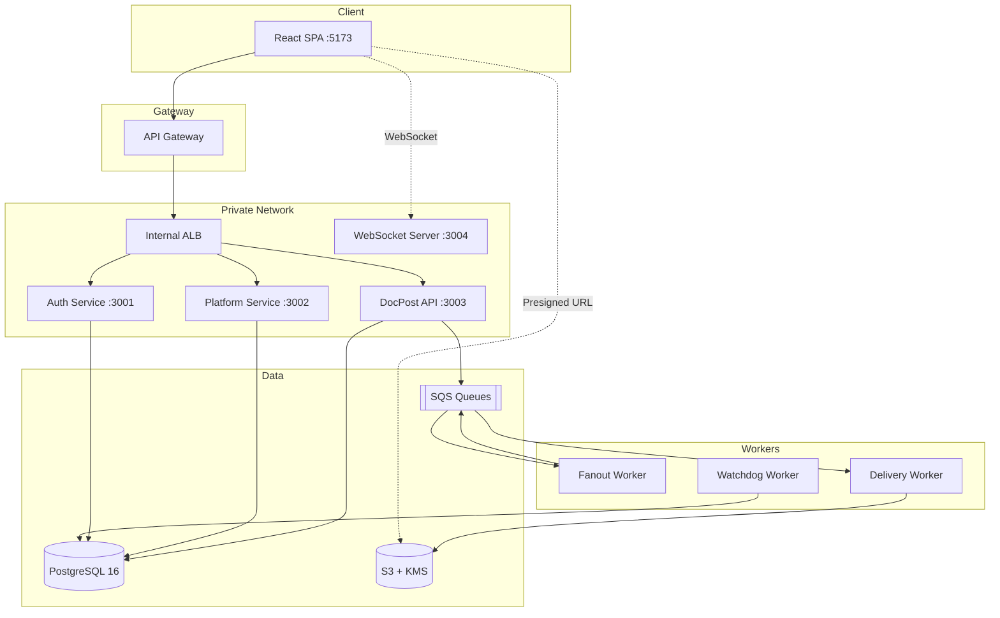

# DocPost

Healthcare document delivery platform for clinical trial coordinators. Upload documents once, deliver them to multiple destinations in a single batch, and track every delivery in real time.

## Why DocPost exists

Clinical trial coordinators spend hours uploading the same document to dozens of destinations one at a time. Files get skipped, land in the wrong binder, and there is no audit trail. DocPost replaces that manual loop with a single batch submission that fans out deliveries in parallel, tracks each one independently, and tells you exactly what succeeded and what failed.

## Architecture



### Components

| Component | Responsibility |
|---|---|
| **Web Client** | React SPA. Browse destinations, upload files via presigned URLs, submit jobs, monitor progress over WebSocket. |
| **API Gateway** | Public entry point. Validates JWTs, applies throttling, routes to private services. Never handles file bytes. |
| **Auth Service** | Registration, login, password reset, JWT issuance (RS256). Issues short-lived service tokens for internal calls. |
| **Platform Service** | Team and membership management. Owns the team → binder → folder hierarchy and user permissions. |
| **DocPost API** | Destination discovery, presigned URL generation, job/task lifecycle. Owns job, task, and file metadata. |
| **WebSocket Server** | Pushes real-time delivery status updates to connected clients. |
| **Fanout Worker** | Receives a submitted job from SQS, explodes it into individual delivery tasks, and enqueues each one. |
| **Delivery Worker** | Picks up a single task, transfers the staged file to its destination, and verifies integrity. |
| **Watchdog Worker** | Monitors in-flight jobs for stalled or timed-out tasks and marks them failed. |
| **S3 + KMS** | Encrypted staging store. Files are retained for 30 days after job completion, then auto-deleted via lifecycle policy. |
| **PostgreSQL** | Three isolated logical databases (`docpost_auth`, `docpost_platform`, `docpost_api`), each with dedicated credentials. |
| **SQS** | Two queues with dead-letter queues: `upload-events` (fanout) and `jobs` (delivery). |

## Tech Stack

- **Runtime:** Node.js + TypeScript
- **Monorepo:** Turborepo + npm workspaces
- **Web:** React, Vite, CSS custom properties
- **ORM:** Drizzle ORM
- **Auth:** RS256 JWT with service-to-service client tokens
- **Storage:** Amazon S3 with KMS server-side encryption
- **Queues:** Amazon SQS with dead-letter queues
- **Database:** PostgreSQL 16
- **Infrastructure:** Terraform (AWS: ECS Fargate, ALB, API Gateway, CloudFront, RDS, S3, SQS, Lambda)
- **CI/CD:** GitHub Actions
- **Local dev:** Docker Compose (Postgres + LocalStack)

## Project Structure

```
DocPost/
├── web/                    # React SPA (Vite)
├── services/
│   ├── auth/               # Authentication service
│   ├── platform/           # Team & membership service
│   └── docpost-api/        # Core API (jobs, tasks, files)
├── workers/
│   ├── fanout/             # Job → task fan-out
│   ├── delivery/           # File delivery execution
│   ├── watchdog/           # Stalled task detection
│   └── ws/                 # WebSocket push server
├── packages/
│   └── shared/             # Shared types and utilities
├── infra/
│   ├── modules/            # Terraform modules (alb, api-gateway, cdn, ecr, ecs-service, lambda, network, rds, s3, sqs)
│   └── envs/
│       ├── dev/            # Dev environment
│       └── prod/           # Prod environment
├── scripts/                # DB init, seed, migration, deploy helpers
├── .github/workflows/      # CI and per-service deploy workflows
├── docker-compose.yml      # Local Postgres + LocalStack
└── turbo.json              # Turborepo task config
```

## Local Development

### Prerequisites

- Node.js (LTS)
- Docker & Docker Compose

### Setup

```bash
# Install dependencies
npm install

# Start Postgres and LocalStack
docker compose up -d

# Create tables and seed local data
npm run db:seed
```

`db:seed` creates all tables and loads local users and team hierarchy. New accounts are automatically added to every team (`AUTO_ASSIGN_ALL_TEAMS=true`). More granular permission assignment will be available in v2.

### Running

```bash
# Start all services, workers, and the web client
npm run dev
```

This starts everything via Turborepo:

| Component | URL |
|---|---|
| Web client | http://localhost:5173 |
| Auth service | http://localhost:3001 |
| Platform service | http://localhost:3002 |
| DocPost API | http://localhost:3003 |
| WebSocket server | ws://localhost:3004 |

The Vite dev server proxies API requests so the SPA works without CORS configuration:

| Path | Proxied to |
|---|---|
| `/auth`, `/.well-known` | Auth service (:3001) |
| `/destinations`, `/jobs`, `/files` | DocPost API (:3003) |
| `/ws` | WebSocket server (:3004) |

### Environment Variables

Copy `.env.example` to `.env` and adjust as needed. Key variables:

| Variable | Description |
|---|---|
| `AUTH_PORT` | Auth service port (default: 3001) |
| `PLATFORM_PORT` | Platform service port (default: 3002) |
| `DOCPOST_API_PORT` | DocPost API port (default: 3003) |
| `DATABASE_URL` | PostgreSQL connection string |
| `AWS_REGION` | AWS region for S3/SQS (default: us-east-1) |
| `SQS_FANOUT_QUEUE_URL` | SQS queue URL for job fan-out |
| `SQS_DELIVERY_QUEUE_URL` | SQS queue URL for delivery tasks |
| `S3_BUCKET_NAME` | S3 bucket for document staging |
| `JWT_SECRET` | JWT signing secret |
| `PLATFORM_URL` | Internal URL for the Platform service |
| `AUTO_ASSIGN_ALL_TEAMS` | When `true`, new users are added to all teams on registration |
| `APP_BASE_URL` | Base URL for password reset links |
| `SMTP_*` | SMTP settings for password reset emails (when unset in dev, reset links are logged to console) |

### Scripts

| Command | Description |
|---|---|
| `npm run dev` | Start all services and the web client |
| `npm run build` | Build all packages |
| `npm run lint` | Lint all packages |
| `npm run test` | Run all tests |
| `npm run typecheck` | Type-check all packages |
| `npm run db:seed` | Create tables and seed local data |

### Database

Docker Compose initializes PostgreSQL with three logical databases, each accessed by a dedicated role:

| Database | Service |
|---|---|
| `docpost_auth` | Auth service |
| `docpost_platform` | Platform service |
| `docpost_api` | DocPost API |

Migrations are managed per service with Drizzle ORM. Run `npm run db:seed` after a fresh `docker compose up` to bootstrap tables and seed data.

### LocalStack

Docker Compose starts LocalStack with S3, SQS, and KMS. The init script (`scripts/init-localstack.sh`) creates:

- **S3 bucket** (`docpost-staging-local`) with KMS server-side encryption
- **SQS queues** with dead-letter queues for `upload-events` and `jobs`

## Deployment

Infrastructure is managed with Terraform under `infra/`. Two environments are configured:

- `infra/envs/dev/`: Development
- `infra/envs/prod/`: Production

Terraform modules cover: VPC networking, ALB, API Gateway, CloudFront CDN, ECR repositories, ECS Fargate services, RDS PostgreSQL, S3 buckets, SQS queues, and Lambda functions.

### CI/CD

GitHub Actions workflows:

| Workflow | Trigger | Purpose |
|---|---|---|
| `ci.yml` | Pull requests | Lint, typecheck, test |
| `deploy-auth.yml` | Push to main | Deploy Auth service |
| `deploy-platform.yml` | Push to main | Deploy Platform service |
| `deploy-docpost-api.yml` | Push to main | Deploy DocPost API |
| `deploy-workers.yml` | Push to main | Deploy all workers |
| `deploy-web.yml` | Push to main | Deploy SPA to CDN |
| `infra.yml` | Manual / push | Apply Terraform changes |

## Domain Model

- **Job**: A batch submission containing uploaded files and their destination mappings.
- **Task**: One file delivered to one destination. Tasks succeed or fail independently.
- **Task lifecycle**: `Pending → In Progress → Completed` or `Failed`.
- **Destination**: A specific binder or folder within a team where a file can be delivered.
- **Staging**: Temporary encrypted S3 storage. Files are retained 30 days after job completion.

## License

Proprietary. All rights reserved.
